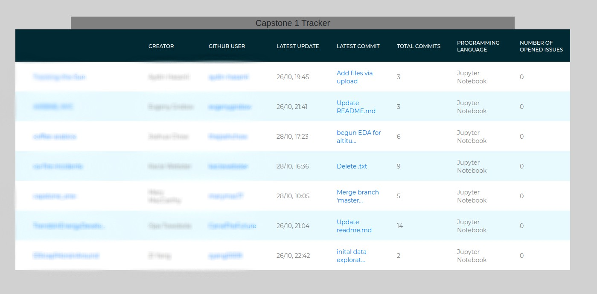

# gitboard
Vanilla Javascript single page GitHub profile tracker.

## Rate limit
Note that GitHub API has a rate [limit](https://developer.github.com/v3/#rate-limiting). 

## Bring your own data.
All data is in [constant.js](./js/data/constant.js).

## To do
1. [ ] enable asynchronized call to speed up loading.
2. [ ] enable dynamically adding profile.
3. [ ] more visually appealing.
4. [ ] rewrite in Vue or React?

## Resources

Original table css is adopted from this [site](https://colorlib.com/etc/tb/Table_Highlight_Vertical_Horizontal/index.html).

## Request feature

Just create an issue or pull request.
